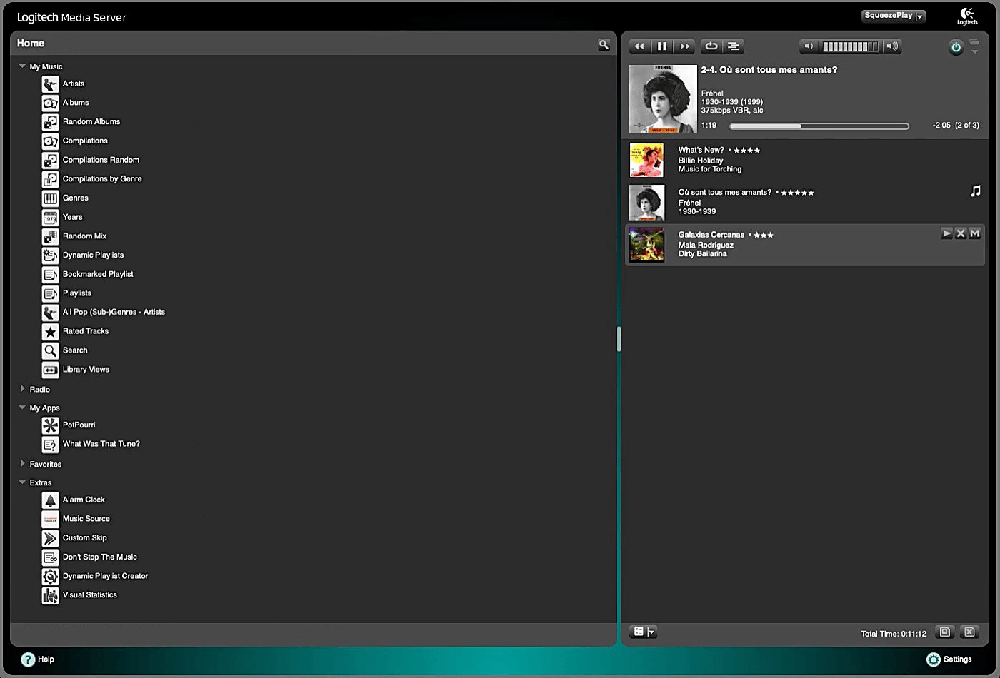

Dark Default Skin
====
 

Just like the LMS *Default skin*, but some UI elements have darker colors. 

For LMS versions >= 9 please take a look at the [**Dark Logic** Skin](https://github.com/AF-1/lms-darklogicskin).  

> [!NOTE]
> ⚠️ Please **clear your browser cache** after switching or updating web skins and **reload** the browser page (multiple times if necessary). 
> If you have any problems, check out the [Lyrion Community Support Forum](https://forums.lyrion.org/).
 

[⬅️ **Back to the list of all plugins**](https://github.com/AF-1/)

   

## What it is and what it is not
The only purpose of *Dark Default Skin* is to provide a dark-themed version of the *LMS Default skin* where some UI elements have darker colors. 
It's only about the **colors** of the UI elements, **not** about adding or (re)moving UI elements, and definitely not about changing how *LMS Default skin* works. *Dark Default Skin* does and will **not** provide any additional functionality beyond that of the *LMS Default skin*. And some UI elements are not modified.
   

## Screenshots[^1]

   

## Installation

* **Dark Default Skin** is available from the LMS plugin library: **LMS > Settings > Manage Plugins**. 

* Once the plugin is installed, go to *LMS* > *Settings* > *Interface*, select **Dark Default** and click *Apply*.

* Don't forget to **clear your browser cache**.

   

[^1]: The screenshots might not correspond to the UI of the latest release in every detail.
